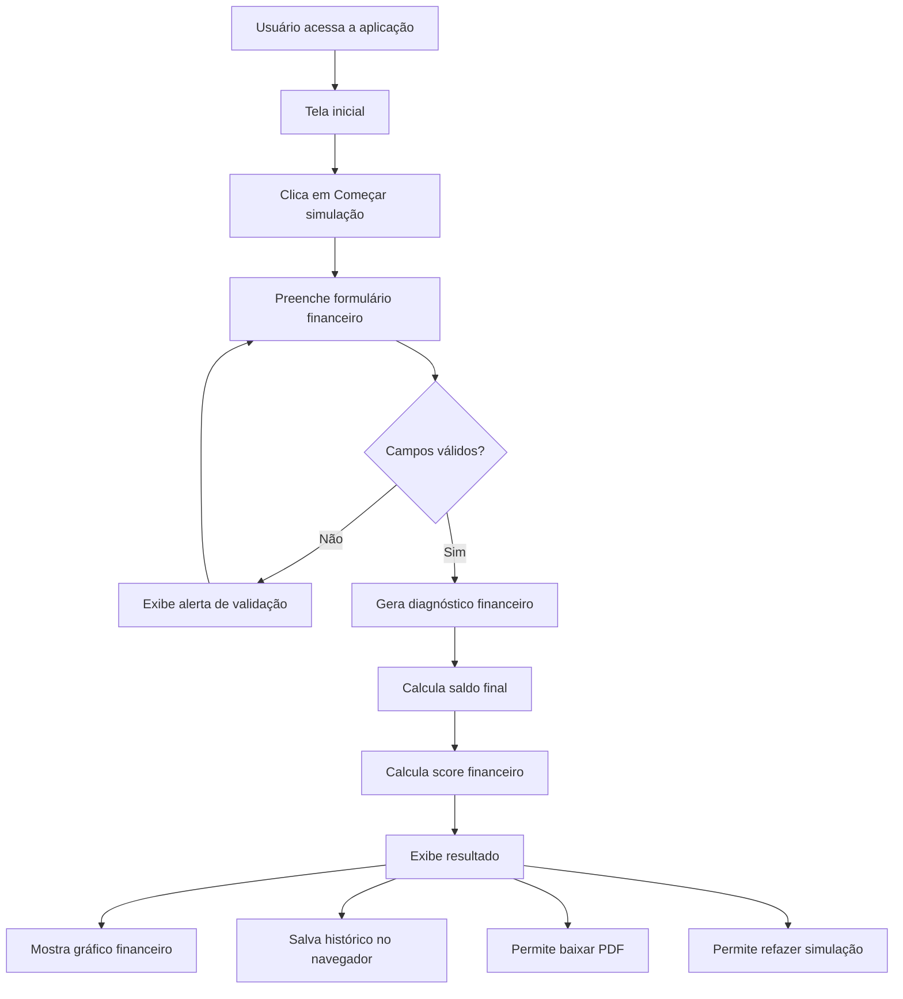
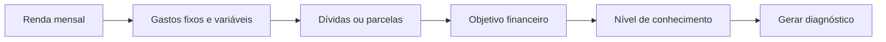
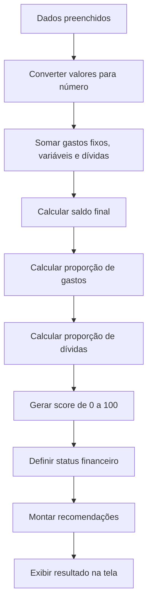
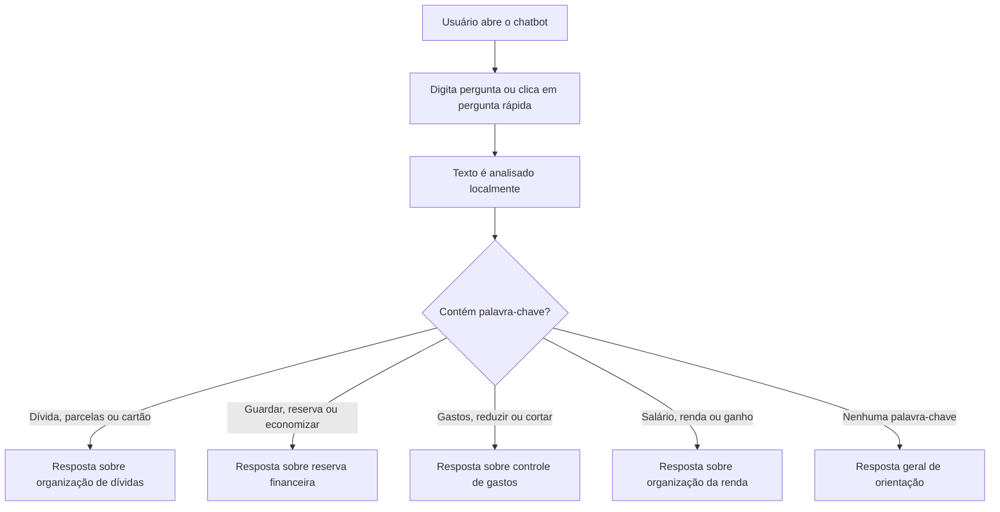
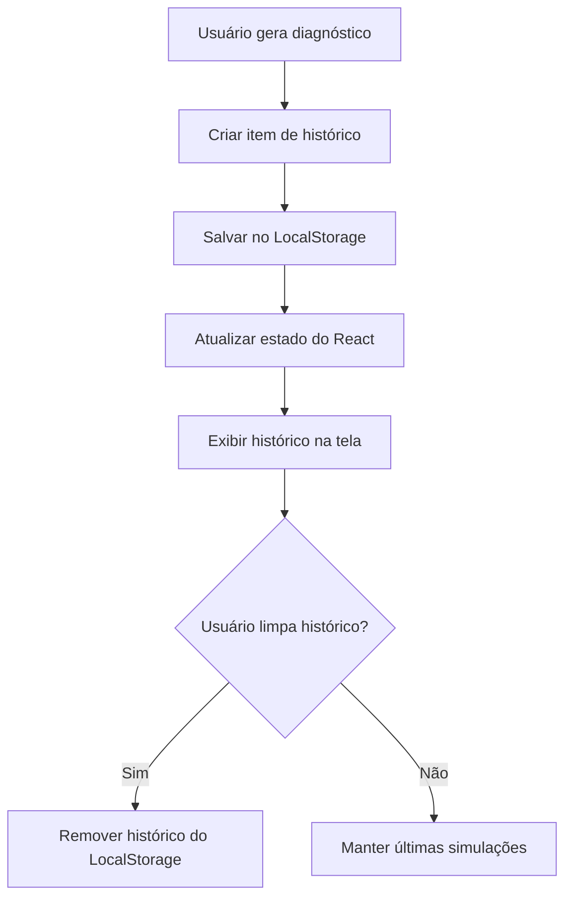
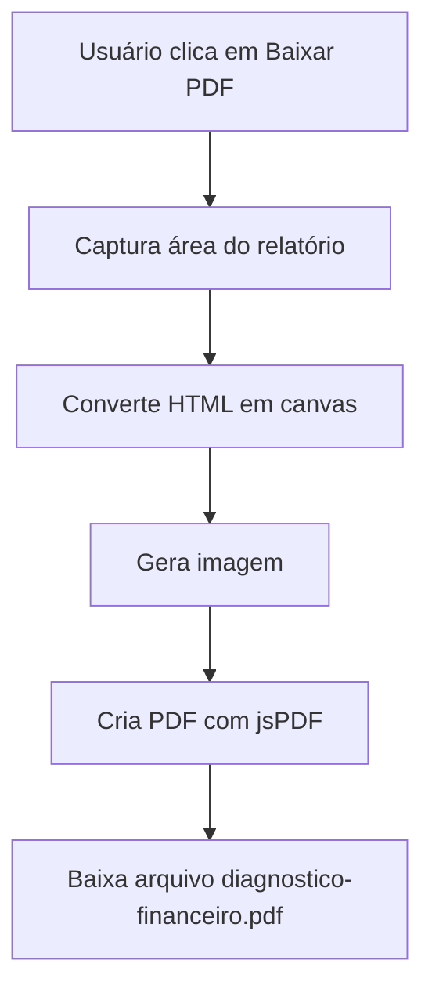

# Educador Financeiro IA


---
🎯 Objetivos do Projeto


Praticar desenvolvimento Front-End com React e TypeScript
Criar uma aplicação web moderna e responsiva
Aplicar componentização e organização de código
Trabalhar com formulários em etapas
Implementar validação de campos
Utilizar LocalStorage para persistência de dados
Criar visualização de dados financeiros com gráfico
Desenvolver um chatbot financeiro local
Exportar relatórios em PDF
Construir um projeto completo para portfólio
Demonstrar habilidades em Front-End, UX/UI e lógica de negócio


---

# 📌 Sobre o Projeto

Aplicação web de **Educação Financeira com IA** desenvolvida para ajudar pessoas a simularem sua situação financeira de forma simples, visual e educativa.

O projeto foi desenvolvido utilizando **React, TypeScript, Vite, CSS e recursos de persistência no navegador**, com foco em Front-End moderno, experiência do usuário, visualização de dados e orientação financeira acessível.

A aplicação permite analisar informações como:

* Renda mensal
* Gastos fixos
* Gastos variáveis
* Dívidas ou parcelas
* Objetivo financeiro
* Nível de conhecimento financeiro
* Saldo final
* Score financeiro

---

<p align="center">
  
</p>

<p align="center">


</p>

---

# ✨ Funcionalidades

✅ Tela inicial profissional

✅ Formulário financeiro em etapas

✅ Validação dos campos

✅ Diagnóstico financeiro educativo

✅ Score financeiro de 0 a 100

✅ Gráfico financeiro com Recharts

✅ Histórico de simulações

✅ Chatbot financeiro local

✅ Perguntas rápidas no chatbot

✅ Tema claro e escuro

✅ Persistência com LocalStorage

✅ Exportação do diagnóstico em PDF

✅ Interface responsiva

✅ Estrutura preparada para futura integração com IA Generativa

---

# 📊 Indicadores Financeiros

## Renda mensal

Permite informar a renda principal da pessoa usuária para simular sua situação financeira.

## Gastos fixos

Considera despesas recorrentes como aluguel, energia, internet, mercado, transporte e outras contas mensais.

## Gastos variáveis

Analisa despesas que podem mudar de mês para mês, como lazer, compras, alimentação fora de casa e gastos extras.

## Dívidas e parcelas

Permite informar compromissos financeiros mensais, como cartão de crédito, empréstimos, financiamentos ou compras parceladas.

## Saldo final

Calcula a diferença entre a renda mensal e o total de gastos informados.

## Score financeiro

Gera uma nota de 0 a 100 com base na relação entre renda, gastos, dívidas e saldo disponível.

## Diagnóstico educativo

Apresenta uma análise simples com pontos de atenção, recomendações e próximos passos para melhorar a organização financeira.

---

# 🏗️ Estrutura do Projeto

```text
educador_financeiro_ia/
│
├── public/
│
├── src/
│   ├── assets/
│   │
│   ├── components/
│   │   ├── ChatBot.tsx
│   │   ├── FinanceChart.tsx
│   │   ├── Header.tsx
│   │   ├── ResultCard.tsx
│   │   ├── SimulationHistory.tsx
│   │   ├── StepForm.tsx
│   │   ├── ThemeToggle.tsx
│   │   └── WelcomeScreen.tsx
│   │
│   ├── services/
│   │   └── geminiService.ts
│   │
│   ├── types/
│   │   └── finance.ts
│   │
│   ├── utils/
│   │   └── storage.ts
│   │
│   ├── App.tsx
│   ├── index.css
│   ├── main.tsx
│   └── vite-env.d.ts
│
├── .gitignore
├── index.html
├── package.json
├── package-lock.json
├── README.md
├── tsconfig.app.json
├── tsconfig.json
├── tsconfig.node.json
└── vite.config.ts

```

---

🚀 Tecnologias Utilizadas
React
TypeScript
Vite
CSS3
LocalStorage
Recharts
jsPDF
html2canvas
Lucide React
Git
GitHub
UX/UI
Data Visualization
Educação Financeira

---

🔄 Fluxo da Aplicação



---

🧾 Fluxo do Formulário



---

🧠 Fluxo do Diagnóstico Financeiro



---
🤖 Chatbot Financeiro

O projeto possui um chatbot local para responder dúvidas simples sobre organização financeira.

Exemplos de perguntas:

Tenho muitas parcelas, o que faço?
Como posso guardar dinheiro?
Como reduzir meus gastos?
Meu salário não está dando, o que faço?

O bot responde com orientações educativas sobre:

Dívidas
Parcelas
Cartão de crédito
Reserva financeira
Gastos
Renda
Organização do orçamento

---

💬 Fluxo do Chatbot



---

📈 Gráfico Financeiro

O gráfico financeiro compara os principais dados informados pela pessoa usuária:

Renda
Gastos fixos
Gastos variáveis
Dívidas
Saldo final

Essa visualização ajuda a entender melhor a relação entre entrada de dinheiro, despesas e capacidade de organização financeira.

---

🧮 Score Financeiro

O score financeiro é uma nota de 0 a 100 calculada com base em:

Proporção dos gastos em relação à renda
Proporção das dívidas em relação à renda
Saldo final disponível

Classificação utilizada:

80 a 100: Boa organização financeira
60 a 79: Atenção moderada
40 a 59: Situação de alerta
0 a 39: Prioridade alta de reorganização

---

💾 Persistência de Dados

O projeto utiliza LocalStorage para salvar informações no navegador.

São armazenados:

Dados preenchidos no formulário
Tema escolhido pela pessoa usuária
Histórico das últimas simulações

Arquivo responsável:

src/utils/storage.ts

---

🕓 Fluxo do Histórico


---

📄 Exportação em PDF

Após gerar o diagnóstico financeiro, a pessoa usuária pode baixar um relatório em PDF contendo:

Score financeiro
Diagnóstico
Gráfico financeiro
Pontos de atenção
Recomendações
Próximos passos
Explicação simples

Bibliotecas utilizadas:

jsPDF
html2canvas

---

📥 Fluxo de Exportação em PDF



---

🔮 Melhorias Futuras
Integração real com Google Gemini API
Chatbot com IA Generativa
Login de usuário
Banco de dados com Supabase ou Firebase
Histórico persistente em nuvem
Dashboard mensal
Mais gráficos financeiros
Comparativo entre simulações
Planejamento financeiro de 30 dias
Deploy final na Vercel
Testes automatizados
Responsividade mobile aprimorada

---

👨‍💻 Autor
Ronaldo Augusto Sabino
Contato

📧 ronaldosabino94@hotmail.com

💼 LinkedIn:
https://www.linkedin.com/in/ronaldo-a-sabino-381a07213

⭐ Projeto desenvolvido para fins educacionais e demonstração de habilidades em Front-End, React, TypeScript, UX/UI e Educação Financeira.

🐙 GitHub:
https://github.com/Ronaldo94-GITHUB


